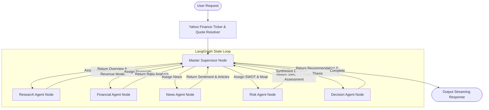
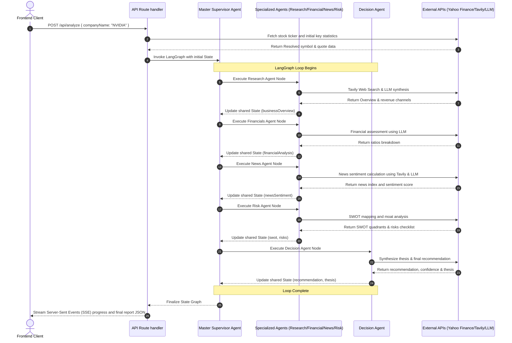

# AI Investment Research Agent

An institutional-grade multi-agent stock market research and analysis platform. This application resolves company names to stock symbols, initiates a multi-agent LangGraph workflow to collect financial metrics, analyzes news sentiment, performs SWOT mapping, evaluates competitive moats, and synthesizes a final Chief Investment Officer (CIO) investment thesis (`INVEST` or `PASS`).

---

## 🏗️ Multi-Agent Architecture



### Sequence Flow Diagram



---

## ⚡ Tech Stack

- **Frontend:** Next.js 16 (App Router), React 19, TypeScript, Tailwind CSS v4, Framer Motion, Chart.js, React Markdown.
- **AI Agent Framework:** LangGraph.js, LangChain.js.
- **LLM Engine:** OpenAI GPT-4o / Google Gemini 2.5 Pro (Dual-capability config with seamless fallback).
- **Search & Scraping:** Tavily Search API, Yahoo Finance Scraper (`yahoo-finance2`).
- **Client Utilities:** `jspdf` & `html2canvas` (PDF generation), `canvas-confetti` (Celebration triggers).

---

## 📁 Folder Structure

```
├── app/
│   ├── api/
│   │   └── analyze/
│   │       └── route.ts          # Streaming Server-Sent Events (SSE) Route
│   ├── globals.css               # Tailwind v4 globals, Glassmorphism, and Animations
│   ├── layout.tsx                # Metadata & fonts layout wrapper
│   └── page.tsx                  # Main Search, Progress Timeline, and Dashboard view
├── components/
│   ├── AgentProgress.tsx         # Real-time multi-agent workflow visualizer
│   ├── Header.tsx                # Brand header navigation
│   └── dashboard/                # Component breakdown for the metrics dashboard
│       ├── CompanyOverview.tsx   # Business profile and revenue models
│       ├── FinancialSummary.tsx  # Key statistics grid and Revenue Bar Chart
│       ├── NewsSentiment.tsx     # Sentiment index radial gauge and article list
│       ├── RecommendationCard.tsx# CIO INVEST/PASS recommendation card & thesis
│       ├── RiskAssessment.tsx    # Moat assessment, growth vectors, and risk checklist
│       └── SWOTAnalysis.tsx      # SWOT quadrants with hover effects
├── langgraph/
│   ├── graph.ts                  # LangGraph instance compilation & runner
│   ├── state.ts                  # Shared state channel annotation schemas
│   └── agents/                   # Individual Agent node functions
│       ├── supervisor.ts         # Master Supervisor orchestrator
│       ├── research.ts           # Business profiling node
│       ├── financial.ts          # CFA ratios assessment node
│       ├── news.ts               # Sentiment indexing node
│       ├── risk.ts               # Risk and SWOT compiling node
│       └── decision.ts           # Final recommendation node
├── lib/
│   └── utils.ts                  # Merge tailwind class helpers (cn)
├── services/
│   ├── llm.ts                    # Dynamic LLM provider manager (OpenAI/Gemini)
│   ├── search.ts                 # Tavily search wrapper with simulated fallback
│   └── finance.ts                # Yahoo Finance symbol resolver with simulated fallback
├── types/
│   └── index.ts                  # Unified TypeScript Interfaces
└── utils/
    └── exportPdf.ts              # High-res client-side PDF compiler
```

---

## ✨ Features

1. **Multi-Agent Decision Loop:** Leverages specialized AI agents working sequentially to analyze different dimensions of a stock.
2. **Server-Sent Events (SSE) Streaming:** Streams real-time agent logging, progress messages, and execution state steps from the backend to the frontend.
3. **Interactive Financial Charting:** Employs Chart.js to render custom Revenue vs Cash Flow bar charts based on live Yahoo Finance filings.
4. **Export as PDF:** High-resolution multi-page PDF generation capturing the full analytics stacked report.
5. **Caching & Search History:** Automatically caches past runs in local storage, allowing instant loading of past reports without repeating API calls.
6. **Robust Simulated Fallbacks:** If API keys (Tavily, OpenAI, Alpha Vantage) are not configured, the system resolves symbols and provides highly realistic simulation records so recruiters can run and evaluate the dashboard instantly.

---

## ⚙️ Installation & Setup

### Prerequisites
- Node.js `v20.0.0` or higher
- npm `v10.0.0` or higher

### 1. Clone & Install
```bash
# Navigate to the workspace
cd "AI Investment Research Agent"

# Install all project packages
npm install
```

### 2. Configure Environment Variables
Create a `.env.local` file in the root directory:
```env
# Set either OpenAI API Key or Gemini API Key (or both)
OPENAI_API_KEY=your_openai_api_key_here
GEMINI_API_KEY=your_gemini_api_key_here

# Search API Key
TAVILY_API_KEY=your_tavily_api_key_here
```

### 3. Run Locally
```bash
npm run dev
```
Open [http://localhost:3000](http://localhost:3000) in your browser.

---

## 🚀 Future Improvements

- **Alternative Datasets Integration:** Fetch and index Glassdoor company ratings, insider trading activity, and patent databases.
- **Portfolio Sandbox:** Enable users to add resolved recommendations to a mock portfolio track record.
- **Multilingual Briefings:** Generate final investment thesis summaries in Spanish, German, Japanese, and Hindi.
